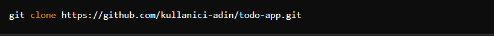
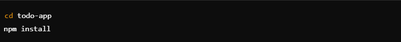
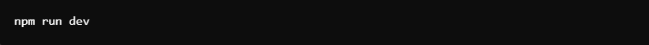
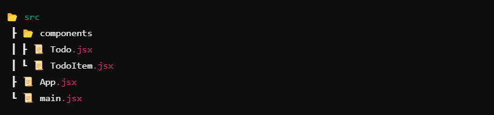
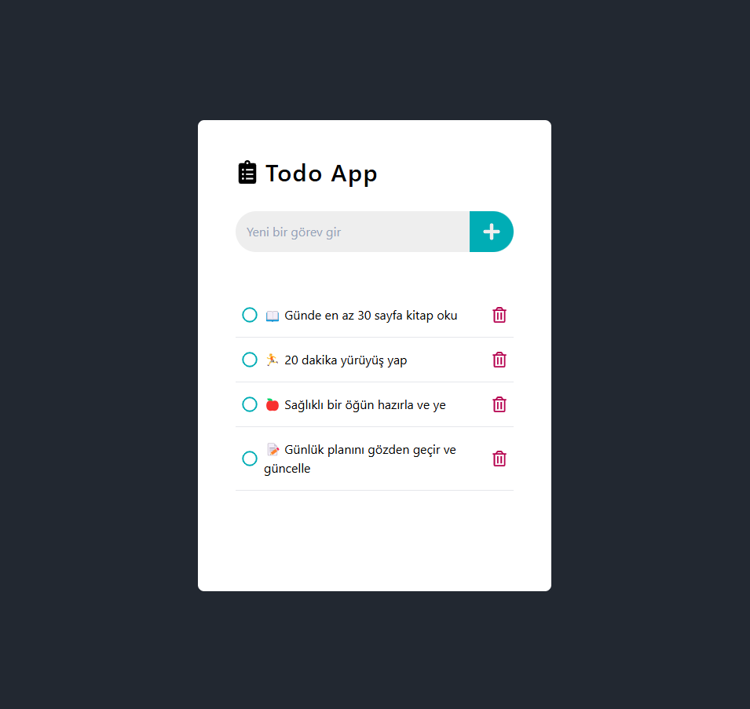
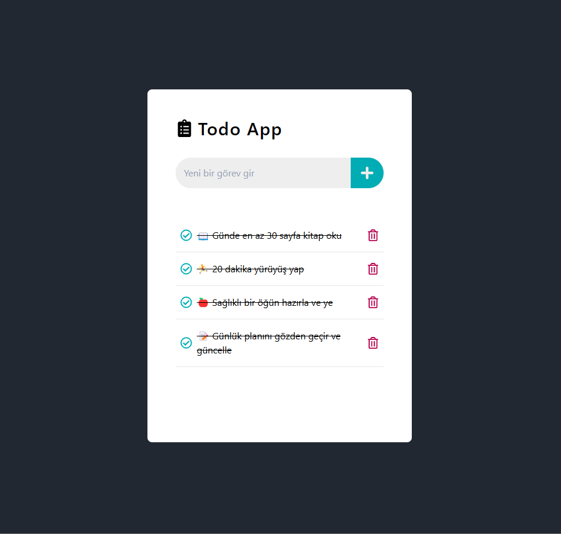
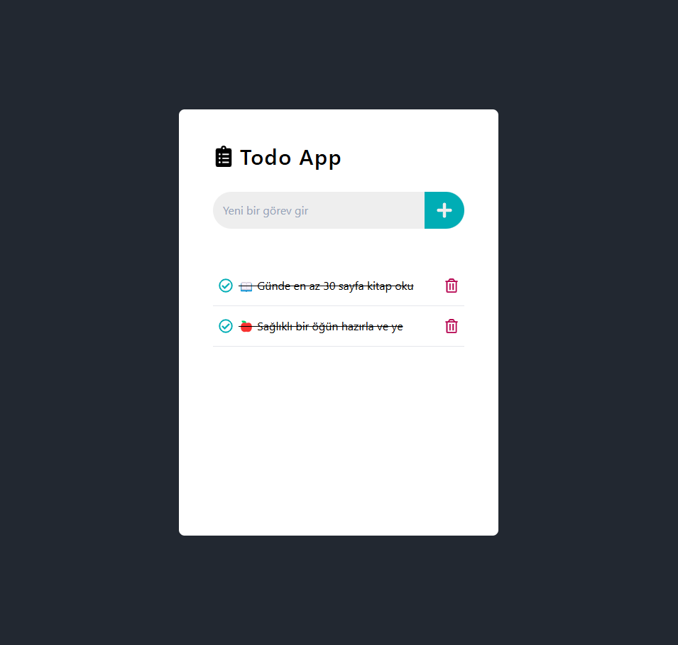

# 📝 Todo App

Bu proje, React ve Tailwind CSS kullanılarak oluşturulmuş basit  bir To-Do uygulamasıdır. Kullanıcılar görev ekleyebilir, tamamlanmış olarak işaretleyebilir ve görevleri silebilir. Ayrıca, görevler localStorage kullanılarak saklanır, böylece sayfa yenilendiğinde bile kaybolmaz.

## 🚀 Özellikler
<ul>
  <li>✅ Görev Ekleme</li>
  <li>🎯 Tamamlandı Olarak İşaretleme</li>
  <li>🗑️ Görev Silme</li>
  <li>💾 LocalStorage Desteği (Veriler kaybolmaz!)</li>
</ul>

## 📦 Kurulum ve Çalıştırma
### 1️⃣ Projeyi Klonlayın

### 2️⃣ Bağımlılıkları Yükleyin

### 3️⃣ Projeyi Çalıştırın

## 📁 Proje Yapısı

Bileşenler:

<ul>
  <li>Todo.jsx → Ana Todo bileşeni (görev ekleme, listeleme, durumu değiştirme)</li>
  <li>TodoItem.jsx → Tek bir görev kartı</li>
</ul>

## 🛠️ Kullanılan Teknolojiler
<ul>
  <li>React - UI oluşturma</li>
  <li>Tailwind CSS - Stillendirme</li>
  <li>localStorage - Verilerin saklanması</li>
</ul>

### EKRAN GÖRÜNTÜLERİ

